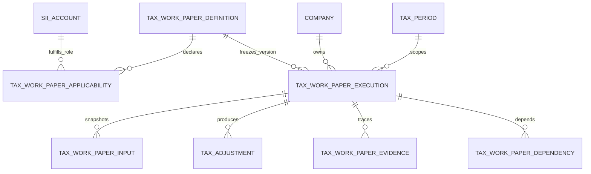

# Papeles de Trabajo Tributarios

## Responsabilidades y reutilización

Este módulo implementa el marco auditable común, no los cálculos de A.1–A.20. Una ejecución pertenece siempre a una empresa, un `tax_period` (que conserva año comercial y tributario) y una versión inmutable de definición. Las fuentes contables siguen viviendo en `tax_documents`, `tax_period_company_accounts`, movimientos y cuentas de empresa; un input conserva una referencia y el snapshot puntual utilizado, no una copia del Balance.

La aplicabilidad reutiliza `company_account_mappings`, `company_accounts`, `tax_period_company_accounts` y `sii_accounts`. Solo un mapping `confirmed`, presente en el período y asociado a una aplicabilidad curada, produce un candidato. Detectar nunca crea ejecuciones ni cambia la homologación.

## Versionado e invariantes

- `(code, version)` identifica una definición histórica; una ejecución apunta a su UUID exacto.
- `(company, period, definition, revision)` es único. Solo hay estados `draft` y `finalized`.
- Una corrección sucede explícitamente a la última ejecución finalizada. No se sobrescribe ni elimina historia.
- Inputs y ajustes tienen revisión/estado propios; las ejecuciones finalizadas consumen snapshots.
- Dependencias apuntan a ejecuciones concretas, incluso de períodos anteriores, y prohíben el autociclo inmediato. No se implementa todavía un DAG.
- `tax_adjustments` duplica deliberadamente company/período para consulta y defensa en profundidad; el servicio debe comprobar que coincidan con la ejecución.

## Calculator futuro (ejemplo A.17)

Implementar una clase TypeScript que cumpla `TaxWorkPaperCalculator`, con `definitionCode = "A.17"` y la versión correspondiente. Registrar una única instancia en `TaxWorkPaperCalculatorRegistry`. El orquestador futuro resolverá balances/documentos/movimientos por tenant, materializará `CalculationInput` con evidencia y snapshot, invocará `calculate(context)` y persistirá atómicamente valores calculados, reconciliación y ajustes. El calculator será puro respecto de mappings y fuentes: no consulta IDs del frontend ni modifica homologaciones.

`CalculationResult` normaliza inputs usados, valores, reconciliación, advertencias, faltantes, evidencia y ajustes. Los ajustes podrán alimentar posteriormente agregaciones RLI/CPT; en esta etapa no modifican F22 automáticamente.

## Fuera de alcance

- Fórmulas o cálculos tributarios A.1–A.20, motor de fórmulas en BD y servicios vacíos por papel.
- Curación completa de cuentas/roles SII, aprobación tributaria, F22, auxiliares completos y ejecución automática.
- Resolución automática de cierre anterior, IPC/tipo de cambio, workflow de revisión y UI de edición.

Antes de activar asociaciones o reglas, contador/auditor debe validar roles, signo/naturaleza, tolerancias, vigencias, evidencia mínima y tratamiento temporal/permanente.
