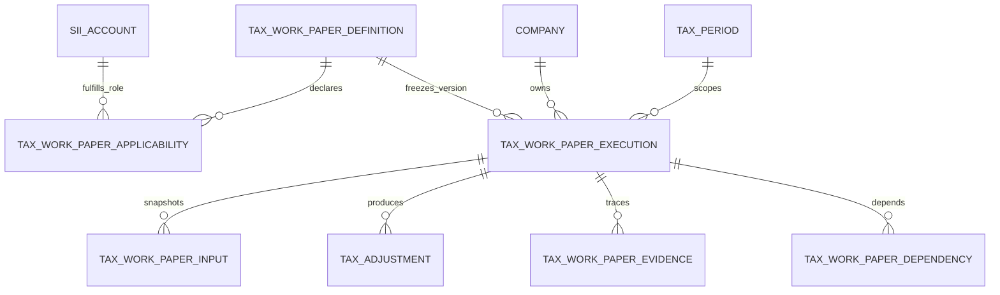

# Papeles de Trabajo Tributarios

## A.17@1 — Obligación en Leasing

Primer vertical ejecutable del framework, desde la perspectiva del arrendatario. Sus roles soportados son `LEASE_LIABILITY` y `DEFERRED_LEASE_INTEREST`; `LEASE_INTEREST_EXPENSE` y `LEASE_REMEASUREMENT` quedan sin asociación hasta que la matriz curada entregue códigos inequívocos. La applicability conserva el **código SII estable** y en runtime lo resuelve contra el UUID de la cuenta de la versión activa. Por ello, un cambio de UUID o nombre del catálogo no altera la detección. No se cargan asociaciones por nombre: los códigos A.17 deben provenir de la matriz externa validada. La detección sigue limitada a homologaciones `CONFIRMED`: no crea ejecuciones, no confirma ni altera mappings y no calcula.

Inputs estables: `LEASE_LIABILITY_OPENING`, `LEASE_LIABILITY_CLOSING`, `DEFERRED_INTEREST_OPENING`, `DEFERRED_INTEREST_CLOSING`, `NEW_LEASE_CONTRACTS`, `LEASE_PAYMENTS`, `LEASE_MONETARY_CORRECTION`, `LEASE_REMEASUREMENTS`, `OTHER_LEASE_MOVEMENTS`, `NEW_DEFERRED_INTEREST`, `DEFERRED_INTEREST_MONETARY_CORRECTION`, `DEFERRED_INTEREST_REMEASUREMENTS`, `OTHER_DEFERRED_INTEREST_MOVEMENTS` y `DEFERRED_INTEREST_AMORTIZATION`. Pagos y amortización son magnitudes no negativas; las correcciones, remediciones y otros movimientos conservan signo.

La obligación se calcula como apertura + contratos nuevos + corrección monetaria + remediciones + otros movimientos − pagos. El interés diferido se calcula como apertura + nuevo interés diferido + corrección monetaria + remediciones + otros movimientos − amortización. Ningún componente faltante se presume cero. Se entregan conciliaciones independientes contra los cierres reportados, con diferencia explícita, tolerancia cero y warning al no cuadrar.

El cierre de obligación e interés diferido se resuelve automáticamente desde cuentas internas con mapping confirmado y el Balance de cierre vigente publicado en `tax_period_company_accounts`; se congelan cuenta, documento, rol y monto. Aperturas y movimientos del período son manuales/auxiliares por ahora: no se clasifican glosas del Mayor y no se inventa el período anterior. Un input manual puede corregir explícitamente un cierre automático y queda trazado al usuario.

Con evidencia e importe no cero se proponen —siempre en estado draft— ajustes RLI por corrección, amortización y cuotas, y ajustes CPT por interés diferido y obligación. Se conserva la dirección económica: una corrección negativa invierte el tipo direccional y no se oculta con valor absoluto. La naturaleza queda `null`, especialmente para CPT, hasta revisión profesional. El contador debe validar procedencia, deducibilidad, dirección y naturaleza tributaria según contrato y régimen; A.17 no genera F22.

`POST /companies/:companyId/tax-periods/:taxPeriodId/work-papers/executions/:executionId/calculate` calcula/recalcula únicamente un draft A.17@1. `GET` sobre esa misma ejecución devuelve snapshot, inputs, faltantes, conciliaciones, warnings, evidencia vigente, `historicalEvidence` y ajustes. El recálculo anula registros draft anteriores y crea una nueva revisión sin borrar historia. Una futura acción común de finalización deberá rechazar ejecuciones con required `missingInputs`, reconciliaciones no resueltas o `requiresProfessionalReview` vigente; calcular nunca equivale a finalizar. A futuro podrá consumir movimientos normalizados del Mayor y referenciar A.5/A.5.1 para impuestos diferidos, sin convertir esa dependencia en requisito.

La matriz A.1–A.20 **ya está versionada e importable**. Vive en `data/curated-applicability-matrix.ts` (transcripción de `Carga Masiva Plan de Cuentas V2.xlsx`, versión `carga-masiva-plan-cuentas-v2-2026-08-09`). Se compila con `compile-curated-applicability.ts` y se persiste de forma idempotente por `definitionId + siiAccountCode + roleKey` (migración `1785045000000` y `pnpm --filter @jivatax/api work-papers:sync-applicability`). No usa UUID ni nombre SII. El dataset conserva las 156 filas fuente; el compilador ignora papel `0` y A.21+ y deja **85** asociaciones A.1–A.20 con `APPLICABILITY_ONLY`. Los códigos A.17 de la matriz (`1.02.30.00`, `1.02.95.00`) activan detección, pero no reciben `LEASE_LIABILITY` / `DEFERRED_LEASE_INTEREST` hasta curación inequívoca de roles.

`GET /companies/:companyId/tax-periods/:taxPeriodId/work-papers/applicable` agrupa por definición y entrega `calculatorKey` / `documentationStatus` desde metadata, `relatedAccounts` deduplicados (cuenta interna + código SII + roleKey) con `rationale`, y `executions[]` con `id`, `status`, `revision`, `supersedesExecutionId` y `finalizedAt`. Detectar no crea ejecuciones ni calcula.

## Responsabilidades y reutilización

Este módulo implementa el marco auditable común, no los cálculos de A.1–A.20. Una ejecución pertenece siempre a una empresa, un `tax_period` (que conserva año comercial y tributario) y una versión inmutable de definición. Las fuentes contables siguen viviendo en `tax_documents`, `tax_period_company_accounts`, movimientos y cuentas de empresa; un input conserva una referencia y el snapshot puntual utilizado, no una copia del Balance.

La aplicabilidad reutiliza `company_account_mappings`, `company_accounts`, `tax_period_company_accounts` y `sii_accounts`. Solo un mapping `confirmed`, presente en el período y asociado a una aplicabilidad curada, produce un candidato. Detectar nunca crea ejecuciones ni cambia la homologación.

## Versionado e invariantes

- `(code, version)` identifica una definición histórica; una ejecución apunta a su UUID exacto.
- `(company, period, definition, revision)` es único. Solo hay estados `draft` y `finalized`.
- Una corrección sucede explícitamente a la última ejecución finalizada. No se sobrescribe ni elimina historia.
- Inputs y ajustes tienen revisión/estado propios; las ejecuciones finalizadas consumen snapshots.
- Dependencias apuntan a ejecuciones concretas, incluso de períodos anteriores, y prohíben el autociclo inmediato. No se implementa todavía un DAG.
- `tax_adjustments` duplica deliberadamente company/período para consulta y defensa en profundidad; el servicio debe comprobar que coincidan con la ejecución.

## Calculator futuro (ejemplo A.17)

Implementar una clase TypeScript que cumpla `TaxWorkPaperCalculator`, con `definitionCode = "A.17"` y la versión correspondiente. Registrar una única instancia en `TaxWorkPaperCalculatorRegistry`. El orquestador futuro resolverá balances/documentos/movimientos por tenant, materializará `CalculationInput` con evidencia y snapshot, invocará `calculate(context)` y persistirá atómicamente valores calculados, reconciliación y ajustes. El calculator será puro respecto de mappings y fuentes: no consulta IDs del frontend ni modifica homologaciones.

`CalculationResult` normaliza inputs usados, valores, reconciliación, advertencias, faltantes, evidencia y ajustes. Los ajustes podrán alimentar posteriormente agregaciones RLI/CPT; en esta etapa no modifican F22 automáticamente.

## Fuera de alcance

- Fórmulas o cálculos tributarios A.1–A.20, motor de fórmulas en BD y servicios vacíos por papel.
- Curación completa de cuentas/roles SII, aprobación tributaria, F22, auxiliares completos y ejecución automática.
- Resolución automática de cierre anterior, IPC/tipo de cambio, workflow de revisión y UI de edición.

Antes de activar asociaciones o reglas, contador/auditor debe validar roles, signo/naturaleza, tolerancias, vigencias, evidencia mínima y tratamiento temporal/permanente.
